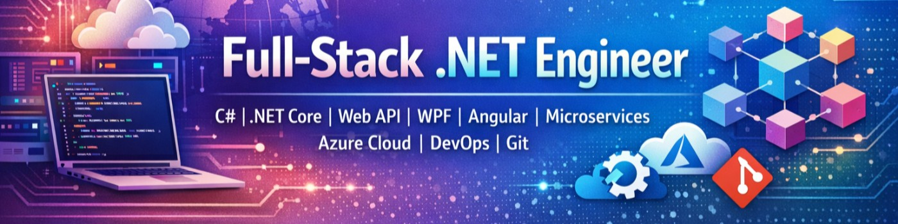

  

<h1 align="center">Hi 👋, I'm Abhinash Sahani</h1>
<h3 align="center">Senior .NET & Azure Cloud Engineer | AZ-104 · AZ-400 · AZ-305 | Microservices · DevOps · Industry 4.0</h3>

  
  
  

---

### 🚀 About Me

- 🎯 **10+ years** building enterprise-grade **C#/.NET** platforms, **microservices**, and cloud infrastructure across manufacturing, SaaS, and Industry 4.0 domains
- 🏗️ Currently leading the **Azure cloud transformation** of a multi-tenant MES SaaS platform — .NET Core, Angular, AKS, Terraform/Bicep, GitHub Actions CI/CD
- ☁️ Hold all **three core Microsoft Azure certifications**:
  - 🏅 **AZ-104** — Azure Administrator Associate
  - 🏅 **AZ-400** — DevOps Engineer Expert
  - 🏅 **AZ-305** — Azure Solutions Architect Expert
- 🧩 Deep domain expertise in **MES/MOM**, **SECS/GEM**, and semiconductor/manufacturing systems
- 🌍 Based in **Nuremberg, Germany** | Open to relocation across Germany & Europe | Remote / Hybrid / On-site
- ⚡ **Immediately available**
- 🎓 EU Blue Card holder — no visa sponsorship required

---

### 🛠️ Tech Stack

**Backend**

  
  
  
  
  
  
  
  
  
  
  

**Frontend**

  
  
  
  
  
  
  
  
  
  

**Architecture**

  
  
  
  
  
  
  
  

**Data**

  
  
  
  
  
  
  

**Cloud & DevOps**

  
  
  
  
  
  
  
  
  
  
  
  
  
  
  
  

**AI**

  
  
  
  
  
  

**Testing**

  
  
  
  
  
  

**Domain**

  
  
  
  

---

### 📊 GitHub Stats

  
  

  

---

### 📫 Let's Connect

  <a href="https://www.linkedin.com/in/abhinash-sahani/">LinkedIn</a> •
  <a href="mailto:abhinash.sahani3@gmail.com">Email</a> •
  📞 (+49) 174 588 8068

